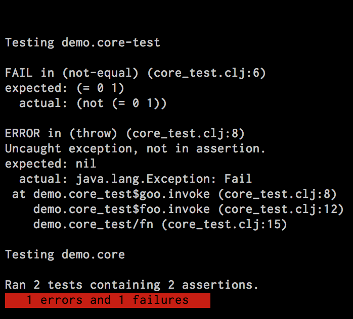

# quickie

A Leiningen plugin that will magically re-run all your tests when a file changes.

## Features

* Uses the builtin clojure.test test runner so you don't need to rewrite your tests
* Tools.namespace will unload and reload namespaces as needed to keep process in sync
* Runs every time a clojure file in your project changes
* Uses (Clansi)[https://github.com/ams-clj/clansi] to show a red or green bar to know if you tests are passing
* Filters out exception stacktraces to remove cruft
* Pass in a test matcher to change which tests are run from the command line.
* __Sends OSD notifications using [notify-send](http://manpages.ubuntu.com/manpages/trusty/man1/notify-send.1.html)__ 

## Usage

Use this for project-level plugins:

Put `[gmatheu/quickie "0.2.7-SNAPSHOT"]` into the `:plugins` vector of your project.clj.

    $ lein quickie

By default all namespaces in your classpath that contain your project name and end with the word `test` will be tested on each run.  To change this, add a line like this to your project.clj: `:test-matcher #"my regular expression"`.  Alternatively, you can call quickie via the command line with the regex you wish to use: `lein quickie "my-project.*\.test\..*"`.

Hit ctrl+c whenever you are done.  Have fun!

## License

Copyright © 2012 Jake Pearson
Copyright © 2014 Gonzalo Matheu

Distributed under the Eclipse Public License, the same as Clojure.
